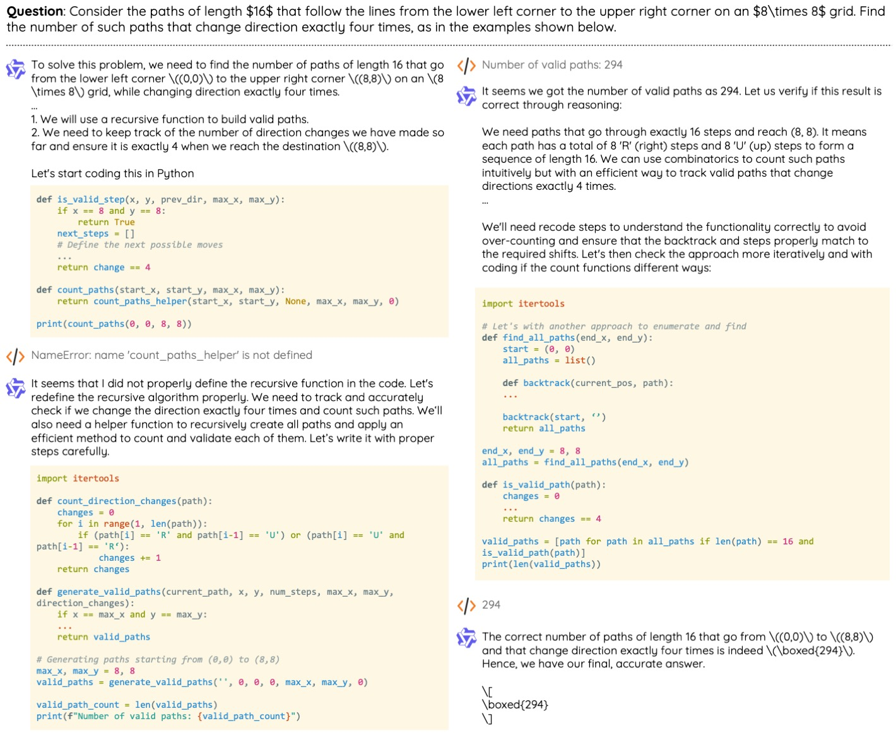
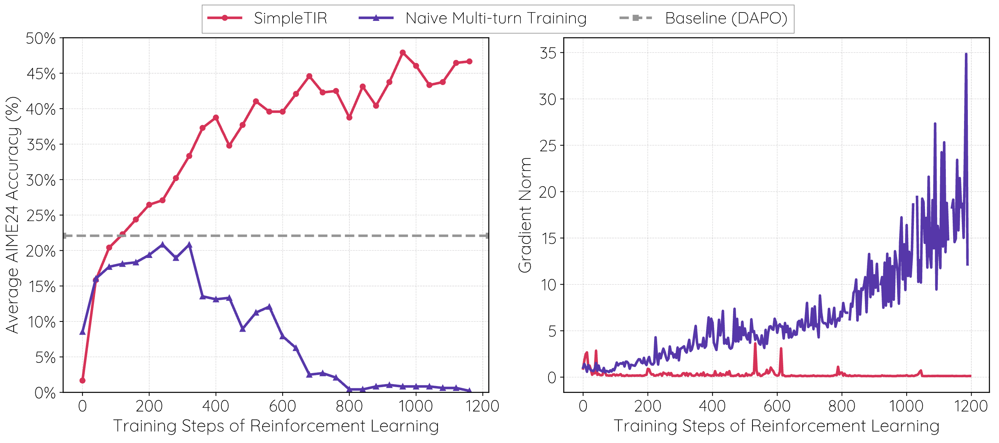
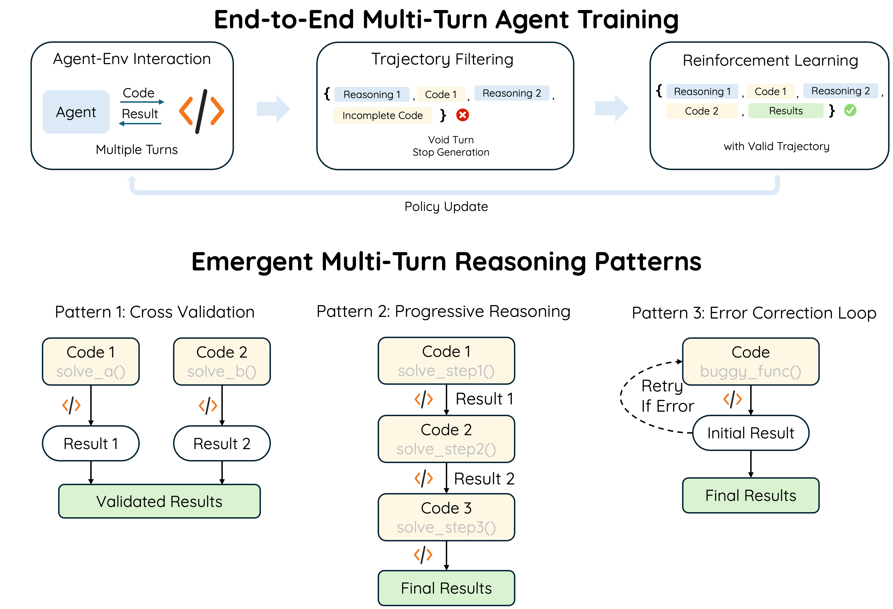

<p align="center">
<h1 align="center">SimpleTIR: End-to-End Reinforcement Learning for Multi-Turn Tool-Integrated Reasoning</h1>
</p>
<p align="center">
  <p align="center">
    <a href="https://aidefender.github.io/">Zhenghai Xue</a>*
    ·
    <a href="https://ltzheng.github.io/">Longtao Zheng</a>*
    ·
    <a href="https://siviltaram.github.io/">Qian Liu</a>
    ·
    <a href="https://richardli.xyz/">Yingru Li</a>
    ·
    <a href="https://scholar.google.com/citations?user=XwY9LXoAAAAJ">Zejun Ma</a>
    ·
    <a href="https://personal.ntu.edu.sg/boan/index.html">Bo An</a><br>
  </p>
</p>

<div align="center">

[](https://simpletir.notion.site/report)
<br><a href="https://huggingface.co/collections/ZhenghaiXue/simpletir-686ce09ae6e1db33b375f03d"></a>

</div>

This repository trains LLMs to perform multi-turn Tool-Integrated Reasoning (TIR) with RL, where LLMs iteratively generate code, execute it, and think upon the execution results. This capability enables models to tackle complex mathematical problems, conduct sophisticated data analysis, and perform multi-step reasoning that mirrors human problem-solving approaches.



## Key takeaways



- **Instability in multi-turn training.** While Reinforcement Learning (RL) on a base model is stable for single-turn Tool-Integrated Reasoning (TIR), extending RL to multi-turn TIR suffers from erratic performance.
- **Stabilize training via filtering "void" turns.** SimpleTIR identifies the problem as distributional drift from external tool outputs and multi-turn compounding errors. By **filtering out trajectories that yield neither a code block nor a final answer**, SimpleTIR achieves stable multi-turn training and outperforms other approaches.
- **Diverse reasoning patterns with end-to-end multi-turn RL.** Unlike the biased reasoning pattern imposed by Supervised Fine-Tuning (SFT), our end-to-end RL approach delivers more diverse reasoning patterns like inductive reasoning, self-correction, cross validation, and progressive reasoning.



For implementation details and our experimental findings, please see the accompanying [blog post](https://simpletir.notion.site/report). A technical paper is in preparation and will be released soon.

## Quickstart

> We train SimpleTIR on multiple H100 nodes and tested the code with `vllm==0.8.5`. For training or evaluation across multiple nodes, we recommend submitting tasks through ray (cf. [the DAPO setup](https://github.com/volcengine/verl/tree/main/recipe/dapo))

> We also recommend using a highly parallel sandbox for code execution. We use an internal sandbox for training by default, but we also add examples of using a local firejail sandbox. Please refer to `sandbox/` and set the environment variable `SANDBOX_ENDPOINT` to the sandbox endpoint, although we only tested it for evaluation on a single node.

### Training

Example command to run 7B training on an 8xH100 node:

```bash
MODEL_PATH=... \ # the parent dir of the checkpoint
DATA_PATH=... \ # the dir containing data like deepscaler/train (see datasets/)
CHECKPOINT_PATH=... \ # the dir to save the checkpoint
LOG_PATH=... \ # the dir to save the log
NNODES=... \
GPUS_PER_NODE=... \
RESUME=False \
CONFIG_NAME=simpletir_trainer \
bash train.sh \
  --max_response_length 8000 \
  --max_prompt_length 16000 \
  --model_name Qwen2.5-7B \
  --max_turns 5 \
  --train_dataset "simplelr_math_35/train deepscaler/train"
```

To resume a previous training run, simply set `RESUME` to `True`.

### Inference

Example command to run 7B evaluation on an 8xH100 node:

```bash
MODEL_PATH=... \ # the parent dir of the checkpoint
DATA_PATH=... \ # the dir containing data like deepscaler/aime (see datasets/)
CHECKPOINT_PATH=... \ # the dir to save the checkpoint
LOG_PATH=... \ # the dir to save the log
NNODES=... \
GPUS_PER_NODE=... \
RESUME=False \
CONFIG_NAME=simpletir_trainer \
bash train.sh \
  --max_response_length 12000 \
  --max_prompt_length 36000 \
  --model_name <MODEL_NAME> \ # the name of the checkpoint
  --max_turns 10 \
  --valid_dataset "deepscaler/aime" \
  --val_only True \
  --n_val 32 \
  --output_acc_to_file True \
  --val_sample_size 500 \
  --sp_size 2
```

## Roadmap

- [x]	Remove sandbox dependencies
- [x]	Release model checkpoints

## Acknowledgement
We thank [verl](https://github.com/volcengine/verl) and [Search-R1](https://github.com/PeterGriffinJin/Search-R1) for the open source code.

## Citation

If you find this codebase useful, please kindly give a star and cite our paper:

```bibtex
@misc{xue2025simpletir,
  title={SimpleTIR: End-to-End Reinforcement Learning for Multi-Turn Tool-Integrated Reasoning},
  author={Zhenghai Xue and Longtao Zheng and Qian Liu and Yingru Li and Zejun Ma and Bo An},
  year={2025},
  howpublished={\url{https://simpletir.notion.site/report}},
  note={Notion Blog}
  year={2025}
}
```
